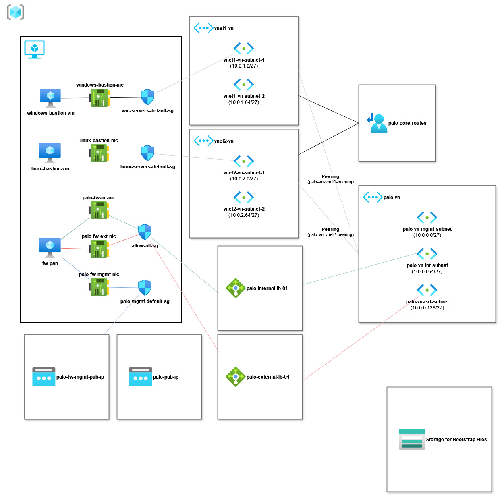

# azure-palo-ngfw
A mostly Terraform IaC template written for Azure I compiled from many different sources. This is different than the Palo Alto NGFW Firewall resource type as you will be deploying the firewall VMs and required load balancers.

## Deploying
Make sure you have Terraform installed and in the user environment path.

1. Make sure you have a role that can deploy the necessary components in the subscription. I use an Azure free account to do my testing, so I had access to everything. 

2. Update the variables.tf file with the required information, especially the account information.

3. Perform the standard Terraform init, plan and apply.

**Default credentials:**

- username: paloalto
- password: Admin1234!

## Topology

## Additional Information

For most all the configuration options you can use on the Palo Alto VM-Series firewall from the image gallery, visit Palo’s ARM template example here:

https://github.com/PaloAltoNetworks/Azure-GWLB/blob/main/security-stack.json

**custom_data** is a Base64 encoded string that the VM will use, upon first boot, to configure the firewall.

Here are the fields you would need to use a bootstrap script:

* storage-account=
* access-key=
* file-share=
* share-directory=

If you are using Panorama, you would paste the configuration string that Panorama generates for the firewall.

## Bootstrap
I do use the bootstrap method demonstrated from Palo Alo.

Here is the original documentation of everything you can do:

https://docs.paloaltonetworks.com/pan-os/10-1/pan-os-admin/firewall-administration/bootstrap-the-firewall

If just deploying in Azure, here is the minimalistic directory structure:

* bootstrap
  - config
    - bootstrap.xml
    - init-cfg.txt
  - content
  - license
    - authcodes
  - software

The above bootstrap.xml is just your standard device configuration file. If you would like a complete archive (tgz), visit Palo’s page:

https://github.com/PaloAltoNetworks/Azure-GWLB

The init-cfg.txt is not documented well, but I was able to verify these options work:

If configuring plugins, you would start a line with this text:

    plugin-op-commands=

And then add the options you’d, separated by commas:

    Azure-gwlb-inspect:enable

This example will enable VXLAN support for a Azure Gateway Load Balancer. Other options are documented here:

https://docs.paloaltonetworks.com/vm-series/11-0/vm-series-deployment/set-up-the-vm-series-firewall-on-azure/deploy-the-vm-series-firewall-with-the-azure-gwlb
